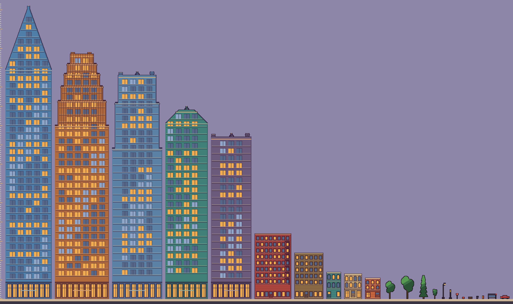
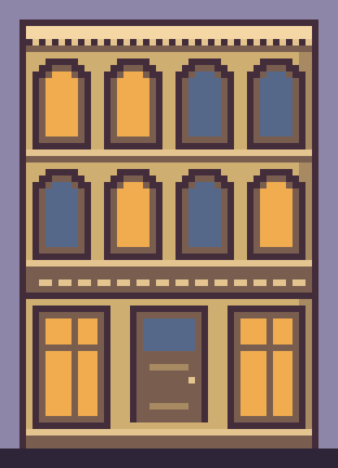

# Spider Swing

A physics sandbox where a pixel-art web slinger swings through an endless procedural city. Every number on screen comes from the solver, and in lab mode every number in the solver is a slider.

Vanilla JavaScript. Canvas 2D. **No dependencies, no build step, no framework.** Clone it and open it.

<!-- Drop a gameplay GIF or screenshot in here. docs/gameplay.gif -->

---

## Run it

```bash
npm run serve
```

Then open <http://localhost:8000>. Node 18 or newer, and nothing to install — `npm run serve` just runs `node tools/serve.js`. Any static server works, but the page uses ES modules so opening the file directly will not.

Add `?seed=123` to the URL for a different city. The same seed always gives the same skyline.

```bash
npm test
```

118 tests, about a third of a second.

## Controls

| | |
| --- | --- |
| **Hold click** | shoot a web at the rooftop nearest where you point |
| **W** / **S** | reel the rope in and out |
| **Space** | toggle the web |
| **M** | cycle real → heroic → lab |
| **L** | jump straight to the lab |
| **H** | hide the readouts |
| **R** | reset |

## Three modes

- **Real** — the honest simulation. Air is thick, gravity is 9.81, and you will be on the pavement in about four swings. That is what swinging on a rope actually does.
- **Heroic** — same solver, thinner air, heavier gravity, and a pull along the web he could plausibly produce with his arms. Measured over two minutes: **323 swings, 5.09 km, never touches the street.**
- **Lab** — nineteen sliders covering every parameter the solver reads, six world presets, and live derived readouts. There is no apply button because there is no reason for one: gravity changes under him mid-swing.

---

## The physics

Everything in `src/physics/` is pure and tested without a browser.

**Integration**
- Fixed-timestep accumulator at 240 Hz, decoupled from display rate, with alpha interpolation between the last two states
- Semi-implicit (symplectic) Euler — plain Euler pumps energy into an orbit and a frictionless pendulum would spiral outward

**Forces**
- Quadratic drag `F = ½ρC_dA·v²`, giving a terminal velocity of `√(mg/k)` = **40.4 m/s** at the defaults
- Tension-only rope forces — a rope pushes nothing

**The web**
- Rigid mode is a position-based distance constraint, solved by projection
- Elastic mode is a damped spring, selectable at runtime
- Reeling a loaded rope does work on the body — the same physics as pumping a playground swing
- Reach is an **ellipse**, not a circle: a web fires 1.45× further straight up than along the street, because a vertical rope makes a tight fast arc and a horizontal one makes a lazy arc

**Readouts** — 25 live metrics in five groups: speed and its components, height, acceleration, web tension and load in body weights, drag, weight, net force, kinetic and potential energy, power split into drag and assist, plus the swing seen as a pendulum (length, angle, angular rate, centripetal acceleration, small-angle period).

---

## The city

- Never stored, only derived. A chunk is a **pure function of `(seed, layer, chunkIndex)`**, so you can swing east for ten minutes, come back, and every building is exactly where you left it.
- Three parallax layers plus a street layer, with atmospheric haze standing in for distance — which really is just contrast being eaten by air
- Webs stick to **rooftops of real buildings only**. Shops, trees, lamps, signals and benches are scenery, and three tests hold that line.

**Aiming** went through three designs. Nearest-to-cursor hands you a ledge behind your shoulder. Direction-scoring cannot pick a roof above the top of the window, because that is somewhere you physically cannot put the pointer. The version that works scores a **vertical column** of the city, charging 0.05 m of error per metre a roof sits *above* your cursor against 0.55 per metre *below* — up is the direction you cannot ask for, so asking is cheap.

| | before | after |
| --- | --- | --- |
| aim finds something | 95% | **100%** |
| pick lands in your column | 43% | **76%** |
| average miss from the column | 24 m | **10.8 m** |
| grabs a tower above the frame | — | **411/411** |

---

## The art

Everything is drawn on one grid where **a cell is 0.2 metres**, hand-authored as letters and rasterised once.



Sizes are real. A door is 2.1 m wherever it appears, a lamp post is 8, a hydrant is 0.8, a car is 4.4. That is the only thing that makes a street read as a street rather than a row of icons at whatever size looked nice — get one wrong and the eye finds it, because everybody already knows how tall a door is.

- **Four building kinds** — shop, townhouse, block, tower — and **five tower silhouettes**: setback, deco ziggurat, spire, chamfer, slab
- **Thirteen pavement props** — four trees, lamp post, traffic signal, stop sign, bus shelter, post box, bin, bench, hydrant, parked car
- Nine facade tones, six of them mixed from a single face colour, so the whole city lights identically
- Curtain walls get mullions, transoms, spandrel bands, corner returns, and a diagonal band of reflected sun. Offices are lit **by the floor, not by the window** — lighting them one at a time gives static, lighting them in bands gives a building.



Arch profiles and tree crowns are written out by hand, row by row, because a circle rounded to whole cells puts the steps in the wrong places and on something seven cells wide you can see it.

**One honest cheat.** The hero is drawn about two and a half times life size. A 1.8 metre figure against a 120 metre tower is a speck at any zoom that still frames the city. The physics never sees that number, only the renderer does.

---

## Architecture

```
src/physics/   solver, assist, tunables, derived metrics   pure, no browser
src/world/     seeded generation, chunking, anchor scoring pure, no browser
src/render/    camera, scene, sky, city, streetscape
src/render/pixel/  grid, facade builder, props, rasteriser
src/ui/        readouts and the lab panel
tools/         dev server, PNG codec, tracers, renderers
test/          118 tests, node:test only
```

The rendering pipeline is: **description → grid → raster → blit.** The world stores what a building *is*; the pixel grid is built the first time it is actually on screen; it is rasterised once at one pixel per cell; after that it is one `drawImage` per frame with smoothing off.

A **4 ms per frame budget** caps how much new sprite work a frame may do. Crossing into a new chunk wants several towers at once, and at ~17 ms each that is a guaranteed dropped frame. Instead a flat block in the right colour at exactly the right size stands in for a frame or two, then the detail lands without anything moving.

| background, per frame | before (fillRect) | after (blit) |
| --- | --- | --- |
| rooftops | 1.43 ms | **0.12 ms** |
| street level | 1.55 ms | **0.19 ms** |
| high altitude | 0.90 ms | **0.11 ms** |

Roughly ten times faster while carrying far more detail, because a tower is one blit instead of about ninety thousand `fillRect` calls.

---

## What measurement changed

The interesting decisions here were all settled with a number rather than a feel.

- **Drag is not why swings lose height.** Turning it off entirely moved apex loss from 15.0 m to 14.8 m. The loss is geometric — he lets go lower than he grabbed. This killed a planned drag-reduction assist.
- **The taut snap costs 0.0 kJ** when you fire ahead of yourself, because the rope goes slack first and catches gently. Another assumed loss that was not real.
- **Thrust along the velocity vector** raises horizontal and vertical speed in the same proportion, so a swing accelerates with no kick anywhere in the arc. Rope-pumping was tried first and rejected: it yanks at the low point and runs out at minimum rope length.
- **A typed-array grid was 1.7× *slower*** than rows of one-letter strings. I had written a comment claiming it was five times faster, benchmarked it properly on a real workload, was wrong, and reverted. The finding is a comment in `grid.js` so nobody retries it.

Tests caught things I did not: a preset that sat outside its own slider, a shop-width hole in the terrace every 260 m, a hydrant and a bin rounding to identical heights, an arch that ate its own top row.

---

## Tools

All written from scratch, no dependencies.

- **`png.js`** — a full PNG decoder *and* encoder: zlib inflate/deflate, scanline unfiltering including the Paeth predictor, CRC32, chunk assembly
- **`serve.js`** — a dev server that sends `no-store`, because browsers cache ES modules hard enough to cost you an afternoon
- **`trace-sprite.js`** — image to character grid, with cell-size detection by most-common run length and majority-vote resampling
- **`render-sheet.js`** — renders every sprite in the game onto one ground line with a metre ruler, so size mistakes have nowhere to hide
- **`swing-budget.js`** — the headless harness behind most of the numbers above

```bash
node tools/render-sheet.js sheet.png 3
node tools/render-facade.js one.png 46 66 8 "#c4633c"
```

---

## Numbers

| | |
| --- | --- |
| source | 33 files, 5,294 lines |
| tests | 11 files, 1,470 lines, **118 tests** |
| tools | 9 files, 1,124 lines |
| runtime dependencies | **0** |
| test-to-source ratio | 0.28 |
| suite runtime | 320 ms |

The original design notes, written before any of this existed, are in [SPEC.md](SPEC.md). Worth reading against what actually got built — the physics core survived almost unchanged, the character went through three complete rewrites.

---

## Credits and licence

The rigged-character path behind `?render=3d` uses [three.js](https://threejs.org), MIT licensed, vendored in `vendor/`. It is kept for comparison rather than actively maintained — the pixel renderer is the real one.

Art in `game references/` is reference material used to develop the sprites and is not original to this project.

Spider-Man is a Marvel Comics character. This is a personal, non-commercial project about pendulum physics.
